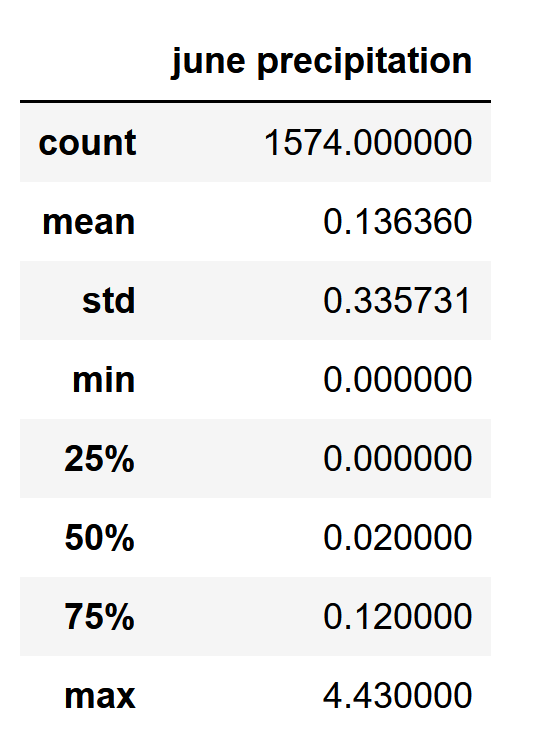
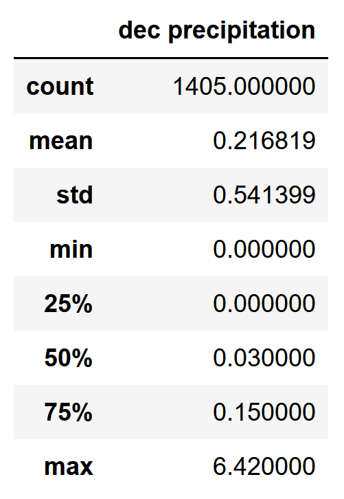
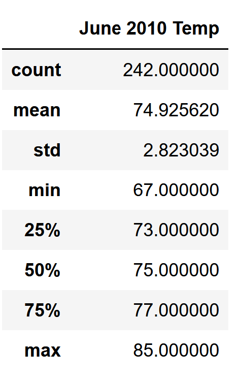
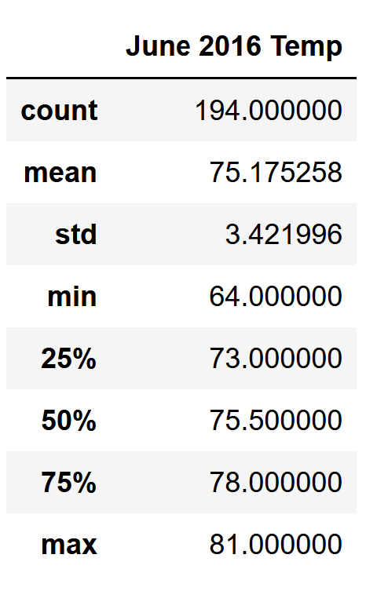
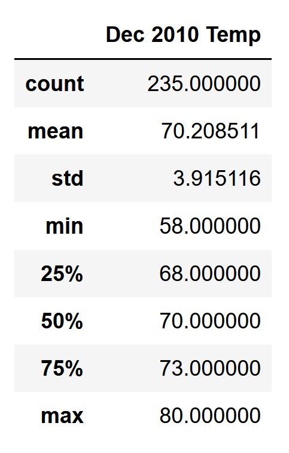
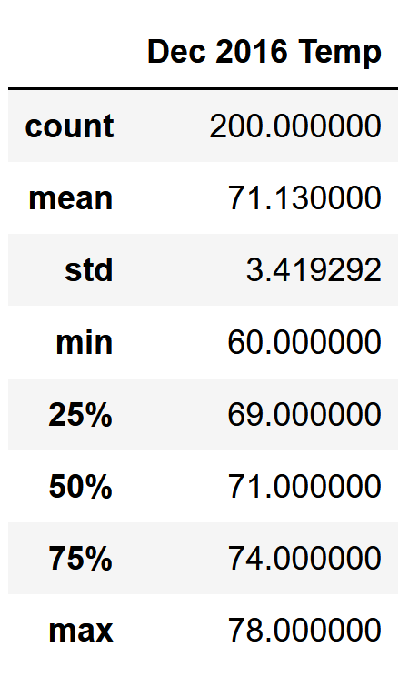

# Surfs Up

## Purpose
The purpose of this study was to help the business owner to determine if having a year-around surf and ice cream shop is sustainable. We will provide data for temprature in both June and December. We provide the mean, max and min tempratures. 

## Results
Three key differences were:
1. There were lower number of temprature counts in December (1517) vs June (1700). 
2. The mean temprature in December is not substantally lower than June differing by about 4 degrees (71.0 vs 74.9).
3. The max temp in June is 85 which is close to what it is in December (83). This shows that overall the temprature is the same or very similar throughout the year.

## Summary

Two extra queries. 

### Precipitation
Over the years the average precipitation in June was .14 units. In December it is .22 units. This is relativily different with having alomst 50% more precipitation in December when compared to June. 

### Temprature change between 2010-2016

In June 2010 the average temprature was 74.9 and June 2016 it was 75.2. In December 2010 the average temprature was 70.2 and in 2016 it was 71.1. Both of these numbers are somewhat similar and assuming that the rise of temprature continues to be constant tempratures should continue to rise.

